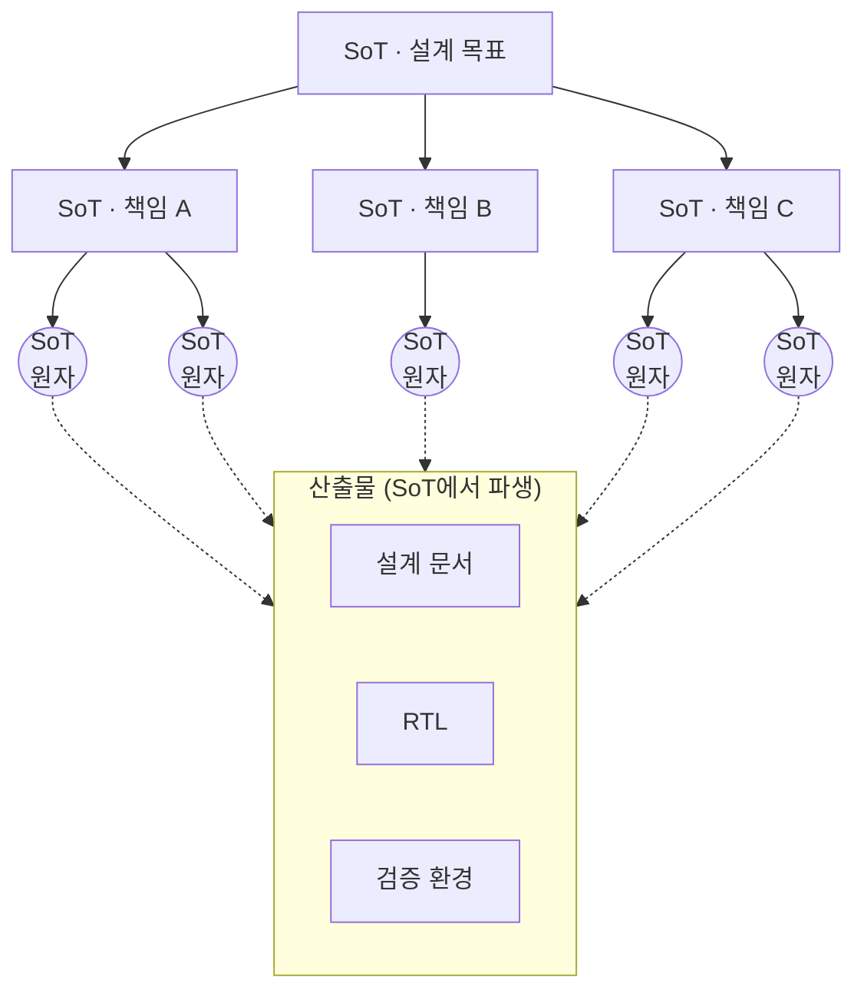
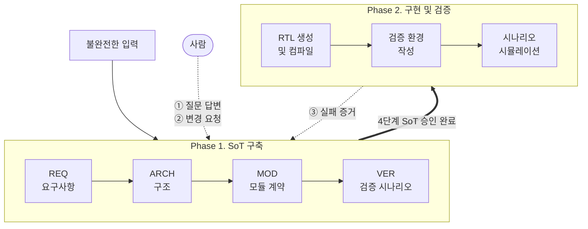
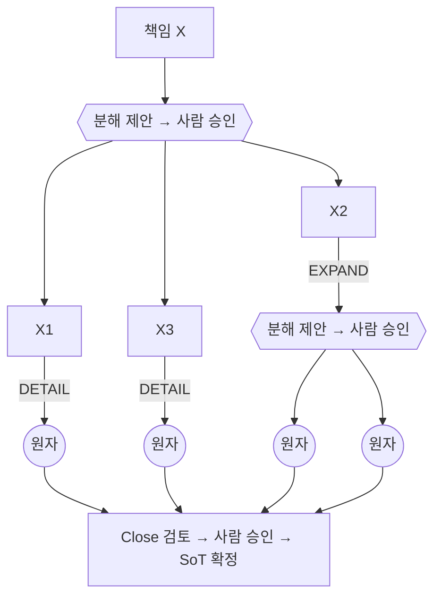
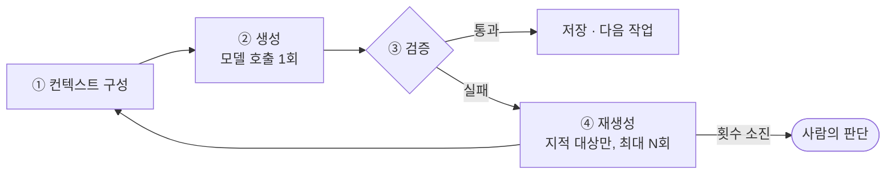

# 진화형 Source of Trust(SoT) 기반 AI Agent HW 설계 하네스 개발 및 IP 설계 적용

## 1. 배경 및 문제 정의

### 1.1 신규 설계의 출발점: 불완전한 입력

신규 IP 설계 착수 시점의 입력은 목표 성능, 용도, 대략적인 인터페이스 수준인 경우가 많다. 상세한 문서가 주어지더라도 다음 요소는 항상 남아 있다.

- **누락**: 리셋 동작, 오류 처리, 경계 조건 등 정해지지 않은 결정
- **모호성**: "적절한 시점에", "기본값은 0"처럼 해석이 갈리는 표현
- **충돌**: 문서의 서로 다른 부분이 상충하는 요구

이 때문에 설계자는 착수 단계에서부터 무엇을, 어떤 순서로, 어느 수준까지 결정해야 하는지 판단하는 데 어려움을 겪는다.

### 1.2 현업 설계 프로세스의 한계

현업에서는 일반적으로 설계 문서를 먼저 작성한 뒤 코딩을 시작한다. 그러나 설계 문서가 완전하지 않기 때문에 다음과 같은 문제가 반복된다.

### 1.3 기존 AI 기반 설계의 한계

LLM을 활용한 RTL 생성은 공개 벤치마크에서 의미 있는 성과를 보이고 있다. 그러나 대부분 **완성된 사양 → 코드** 문제를 다룬다.

실제 설계에 적용할 때 AI는 사양의 빈칸을 그럴듯한 추측으로 채운다. 이 추측은 코드 내부에 숨어 있어 검토 과정에서 드러나기 어렵다. 결과적으로 1.2절의 문제가 더 빠르게, 더 보이지 않게 발생한다.

### 1.4 문제 정의

필요한 것은 더 나은 코드 생성기가 아니라, **불완전한 입력으로부터 사용자의 의도를 끌어내고, 이를 검증 가능한 형태로 고정하며, 변경과 실패에 따라 함께 갱신되는 설계 기준**이다.

---

## 2. 과제 목표

1. 불완전한 입력에서 출발하여 사용자의 암묵적 의도를 체계적으로 끌어내는 설계 하네스를 구축한다.
2. 끌어낸 의도를 최소 책임 단위의 SoT로 축적하고, 모든 설계 산출물을 SoT에서 파생시킨다.
3. 질문, 변경, 검증 실패를 통해 SoT가 사용자와 함께 진화하는 구조를 구현한다.
4. 공개 벤치마크와 현업 HW IP 설계에 적용하여 유효성을 검증한다.

---

## 3. 핵심 개념

### 3.1 SoT의 정의: 설계 의도의 원자

**SoT(Source of Trust)**는 사람이 승인한 설계 기준의 단일 원천이다. AI의 모든 작업은 SoT만을 권위 있는 근거로 사용한다.

SoT는 다음과 같은 관점에서 구성된다.

- 모든 지식과 설계 의도에는 **더 분해하면 의미가 깨지는 최소 책임 단위**가 존재한다. 이를 SoT의 원자로 정의한다.
- 원자의 기준은 **하나의 담당 노드가 다른 책임과 중복 없이 맡을 수 있는 독립된 계약 하나**다. 크기나 개수 기준이 아니며, 관련된 조건과 예외는 같은 원자에 함께 둔다.
- 각 SoT는 하나의 책임을 담는다. 상위 SoT는 하위 SoT로 분해되어 계층 그래프를 이루고, 더 분해되지 않는 최하위 SoT가 원자다. 분해 깊이는 책임에 따라 다르다.
- 의도를 원자 단위로 분해하여 SoT를 먼저 구축한다. 설계 문서, RTL, 검증 환경 등 모든 산출물은 SoT에서 파생된다.
- 책임이 원자 단위로 한 곳에만 존재한다. 따라서 변경은 해당 원자에서 시작하고, 영향 검토도 연결된 원자로 한정된다.
- 예를 들어 공유 버스 아비터에서 '여러 요청이 동시에 오면 라운드로빈 순서로 하나만 허용한다'는 하나의 원자다. 이를 더 나누면 '공정하게 돌아가며 허용한다'는 의미가 쪼개진다.

**[그림 1] SoT 원자 그래프와 산출물 파생**

원은 더 분해되지 않는 원자 SoT를 나타낸다.

### 3.2 사용자와 함께 진화하는 SoT

SoT는 처음부터 완성되지 않는다. 설계가 진행되면서 다음 경로를 통해 성장하고 갱신된다.

- 하네스가 결정할 항목을 **제안**하면 사용자가 승인하거나 수정한다.
- 하네스가 누락, 모호성, 충돌을 발견하면 **질문**하고 사용자가 결정한다.
- 사용자의 생각이 **변경**되거나 검증이 **실패**하면 SoT가 갱신된다.

설계 원칙은 **"사용자가 백지에 쓰게 하지 않고, 구체적인 제안에 반응하게 한다"**이다. 사람은 완전한 사양을 처음부터 작성하기는 어렵지만, 구체적인 제안이나 질문이 주어지면 판단할 수 있다. 이 판단 과정에서 암묵지가 명시적인 규칙으로 전환된다.

---

## 4. 하네스 설계

### 4.1 전체 워크플로우

하네스의 워크플로우는 두 phase로 구성된다.

- **Phase 1. SoT 구축**: 기존 IP 설계 흐름(사양 정의 → 구조 설계 → 상세 설계 → 검증 계획)에 대응하는 4단계로 SoT를 구축한다.
- **Phase 2. 구현 및 검증**: 승인된 SoT를 기준으로 RTL과 검증 환경을 생성하고 시뮬레이션으로 확인한다.

| 단계 | 결정 대상 | 예시 (4채널 라운드로빈 아비터) |
| --- | --- | --- |
| REQ | 무엇을 해야 하는가 | 여러 요청이 동시에 오면 라운드로빈 순서로 하나만 허용한다 |
| ARCH | 어떤 구조로 나누는가 | 우선순위 포인터: 공정한 순서를 위해 다음에 먼저 볼 요청자를 기억하고 갱신하는 책임 |
| MOD | 각 모듈은 어떤 약속을 지키는가 | rr_arbiter: req[3:0]과 last를 받아 gnt[3:0]을 내고, 허용이 끝나면 포인터를 갱신하는 모듈 계약 |
| VER | 어떻게 확인하는가 | 공정성 시나리오: 여러 요청자가 계속 요청할 때 번갈아 허용되는지 확인하는 검증 |

상위 단계의 승인된 SoT는 하위 단계의 권위가 된다. VER까지 4단계 SoT가 모두 승인되면 Phase 2로 넘어간다.

역할은 다음과 같이 분리된다.

| 주체 | 역할 |
| --- | --- |
| 사람 | 결정: 분해 승인, 질문 답변, 변경 요청, 최종 승인 |
| AI | 제안, 작성, 검토 |
| 코드 | 순서, 상태, 권위 통제 |

AI는 스스로 SoT를 승인하거나 확정할 수 없다.

**[그림 2] 전체 워크플로우**

Phase 1의 각 단계는 4.2절의 분해 사이클(분해 제안 → 사람 승인 → 원자 작성 → Close 검토 → 사람 승인)을 따른다. Phase 2의 산출물은 담당 SoT 원자와 연결되며, 실패 원인이 SoT에 있으면 Phase 1의 변경 경로로 되돌아간다(4.4절).

### 4.2 단계 내 분해 사이클

모든 단계는 동일한 사이클로 의도를 원자까지 분해한다.

1. **분해 제안(LIST)**: 현재 책임을 어떤 하위 책임으로 나눌지 제안하고, 사람이 승인한다.
2. **원자 판정**: 각 하위 책임에 대해 둘 중 하나를 선택한다.
   - **DETAIL**: 더 분해하면 의미가 깨지는 경우. 원자로 확정하고 규칙을 작성한다.
   - **EXPAND**: 여러 책임이 섞여 있는 경우. 1번 사이클을 다시 수행한다.
3. **Close 검토 및 승인**: 해당 범위 전체의 누락과 모순을 검토한 뒤, 사람이 승인하면 SoT로 확정한다.

이 사이클을 반복하면 의도는 자연스럽게 원자 단위까지 분해된다. 각 시점에는 그 수준에서 필요한 결정만 다룬다. 사용자는 무엇을 먼저 정해야 하는지 고민할 필요 없이 제시된 제안에 답하면 된다.

**[그림 3] 분해 사이클**

### 4.3 공통 에이전틱 루프

제안, 작성, 검토, RTL 생성, 검증 환경 작성 등 모든 AI 작업은 동일한 루프로 수행된다.

1. **컨텍스트 구성**: 해당 작업에 필요한 SoT 원자와 사용자 결정만 선별해 입력을 구성한다.
2. **생성**: 모델을 1회 호출한다.
3. **검증**: 코드 기반 형식 검사를 수행한다. 지정된 지점에서는 내용을 검토하고, RTL과 검증 환경은 컴파일·시뮬레이션을 실행한다.
4. **재생성**: 검증에서 지적된 대상만, 정해진 횟수(기본 3회) 안에서 다시 생성한다. 횟수를 소진하면 사람에게 판단을 넘긴다.

"성공할 때까지 반복"하는 방식을 배제하였다. 따라서 비용과 결과를 예측할 수 있다. 또한 각 작업의 입력, 결과, 승인 기록을 모두 저장하므로, 중간에 멈추거나 실패해도 저장된 지점부터 다시 진행할 수 있다.

**[그림 4] 공통 에이전틱 루프**

### 4.4 SoT의 진화 경로

| 경로 | 발생 조건 | 처리 | 결과 |
| --- | --- | --- | --- |
| ① 질문 | 누락, 모호성, 충돌 발견 | 선택지와 근거를 담은 질문 카드를 제시하고, 사용자가 답변하거나 기각한다. 답변 해석에도 검토를 적용한다 | 답변이 SoT 원자로 고정되어 이후 모든 단계의 권위가 된다 |
| ② 변경 | 사용자의 의도 변경 | 대상 원자를 재작성한 뒤, 실제 변경 전후 내용을 기준으로 연결된 원자의 영향을 검토하고 필요한 원자만 수정한다 | 전체 재설계 없이 변경이 반영된다. 승인된 단계를 변경하면 이전 승인본을 보존하고 하위 단계는 재승인을 받는다 |
| ③ 실패 | 컴파일·시뮬레이션 실패 | 원인이 코드에 있으면 공통 루프로 코드를 수정한다. 원인이 SoT 계약에 있으면 실패 증거와 함께 변경 경로(②)로 전달한다 | 같은 오해가 다른 모듈이나 단계에서 반복되지 않는다 |

영향 검토는 자동으로 계산된 의존성 그래프에 의존하지 않는다. AI가 실제 변경 내용과 관련 계약을 검토하는 방식이며, 최종 반영은 사람의 재승인을 거친다. 검증되지 않은 의존 관계를 근거로 기존 승인을 유지하지 않도록 설계하였다.

---

## 5. 평가 방법

- **CVDP 벤치마크: 범용성**
  - NVIDIA의 공개 RTL 설계 벤치마크인 CVDP 중 사양→RTL 생성 범주(cid003) 78문제에 하네스를 적용한다.
  - 문제별 맞춤 없이 동일한 워크플로우로 사양 입력부터 RTL 생성과 검증까지 수행한다.
  - 결과는 벤치마크의 공식 채점 환경에서 기능 테스트로 판정한다. 공식 테스트는 하네스 내부 검증이 모두 끝난 뒤 채점에만 사용한다.
  - 동일 모델로 하네스 없이 직접 생성한 결과와 비교한다.
- **의도 복구 실험: 핵심 능력**
  - 불완전하거나 잘못된 입력에서도 하네스가 원래 설계 의도를 복구해 올바른 설계를 만드는지 확인한다.
  - 원본 사양으로 공식 테스트를 통과한 CVDP 문제를 대상으로, 공식 테스트가 검사하는 동작에 대해 사양을 의도적으로 훼손한다.
    - **삭제**: 동작을 정의하는 문장을 제거한다.
    - **모호화**: 정확한 표현을 해석이 갈리는 표현으로 바꾼다.
    - **모순**: 일부 값이나 조건을 바꿔 다른 부분과 충돌하게 한다.
  - 원본 사양을 의도로 가진 사용자가 하네스가 질문한 사항에만 답한다.
  - 원본 기준 공식 테스트로 판정하고, 같은 훼손 사양을 하네스 없이 직접 생성한 결과와 비교한다.
  - 주 지표는 하네스 복구율이다. 훼손된 사양으로 하네스를 실행했을 때 원본 기준 공식 테스트를 통과한 비율이며, 같은 사양을 하네스 없이 직접 생성한 결과의 통과율과 비교한다.
  - 보조로, 복구한 사례 중 훼손 지점에 대한 질문을 거쳐 복구된 비율을 함께 기록한다. 질문이 훼손 지점을 짚었는지에 대한 판정 기준은 실행 전에 정한다.
- **현업 설계 적용: 실전 규모**
  - 현업 IP 설계에 하네스를 적용해 SoT 구축부터 RTL 검증까지 완주하는지 확인한다.
  - 승인된 검증 시나리오의 시뮬레이션 결과로 판정한다.
- **정량 지표: 비용과 효율**
  - 소요 시간, 토큰 사용량과 비용, 사람 결정 횟수(승인 · 질문 답변 · 변경 요청)를 기록한다.

---

## 6. 수행 결과

### 6.1 CVDP 벤치마크

- 대상: CVDP v1.1.0 사양→RTL 생성(cid003) 78문제
- 결과: `[TBD]`
- 같은 모델을 하네스 없이 사용한 기준선, 다른 연구의 결과와 함께 정리하면 다음과 같다.

| 연구 | 모델 | 방식 | 결과 |
| --- | --- | --- | --- |
| CVDP [1] | GPT-4.1 | 단일 생성 (5회 샘플 pass@1) | 44.0% |
| CVDP [1] | Claude 3.7 Sonnet | 단일 생성 (5회 샘플 pass@1) | 48.0% |
| ChipV-RTL [3] | Claude 3.7 Sonnet | 시뮬레이션 기반 반복 디버깅 | 61.5% |
| ACE-RTL [2] | RTL 특화 학습 모델 | 병렬 5개 × 최대 30회 반복 중 통과한 문제 비율 (APR) | 96.15% |
| ChipCraftBrain [4] | Claude Opus 4.6 / Sonnet 4.6 | 최대 5회 반복, 3회 실행 평균 | 96.2% |
| HORIZON [5] | GPT-5.3 | 첫 반복 19.2% → 24회 반복 후 100% 달성 | 100.0% |
| 기준선 | DeepSeek Flash v4.1 | 단일 생성 (5회 샘플 pass@1) | `[TBD]` |
| 본 과제 | DeepSeek Flash v4.1 | SoT 기반 설계·자체 검증, 반복 없이 문제당 1회 실행 | `[TBD]` |

※ 본 과제 결과는 고정한 하네스 버전으로 측정하였다. "반복 없이 문제당 1회 실행"은 같은 문제를 다시 실행하거나 여러 실행 중 좋은 결과를 고르지 않았다는 뜻이며, 실행 안에서 자체 테스트로 검증하고 수정하는 과정은 포함한다. 
※ 사람의 결정 지점은 자동으로 처리하였다. 구성 승인과 최종 승인은 자동 승인, 질문은 하네스와 같은 모델이 원문만을 근거로 답하였다. 따라서 결과는 사람의 개입 없이 얻은 것이다.

- 측정 방식이 서로 다르므로 수치를 직접 비교할 때 주의가 필요하다.
  - 다른 에이전트 연구[2][4][5]는 채점에 쓰이는 벤치마크 테스트를 실행해 실패 결과를 보고 수정하는 과정을 반복한다.
  - 본 과제는 SoT로부터 작성한 자체 테스트로 검증하고 수정하며, 벤치마크 테스트는 내부 검증이 끝난 뒤 채점에만 사용한다.

### 6.2 의도 복구 실험

| 훼손 유형 | 하네스 복구율 | 직접 생성 통과율 |
| --- | --- | --- |
| 삭제 | `[TBD]` | `[TBD]` |
| 모호화 | `[TBD]` | `[TBD]` |
| 모순 | `[TBD]` | `[TBD]` |

- 하네스가 복구한 사례 중 `[TBD]`%는 훼손 지점에 대한 질문을 거쳐 복구되었다.

### 6.3 현업 설계 적용

- 대상: NPU 코어의 VPU IP

| 항목 | 값 |
| --- | --- |
| 검증 결과 | 승인된 검증 시나리오 `[TBD]`개 중 `[TBD]`개 통과 |
| 설계 규모 | 모듈 `[TBD]`개, RTL `[TBD]`줄, 검증 시나리오 `[TBD]`개 |
| SoT 원자 수 (REQ / ARCH / MOD / VER) | `[TBD]` |
| 사용자에게 물은 결정 (질문 카드) | `[TBD]`건 |
| 설계 중 변경 요청 반영 | `[TBD]`건 |
| 검증 실패 후 복구 | `[TBD]`건 (코드 수정 `[TBD]`, SoT 수정 `[TBD]`) |

- 주요 질문 사례: `[TBD: 원문에 없던 결정 2~3개]`

### 6.4 정량 지표

| 지표 | CVDP (문제당 평균) | 현업 설계 |
| --- | --- | --- |
| 소요 시간 | `[TBD]` | `[TBD]` |
| 토큰 사용량 · 비용 | `[TBD]` | `[TBD]` |
| 사람 결정 횟수 (승인 · 질문 답변 · 변경 요청) | 0 (자동 처리) | `[TBD]` |

---

## 7. 기대 효과 및 활용 방안

본 하네스는 설계자를 대체하지 않는다. 신규 IP 착수부터 초기 설계까지를 지원하는 보조 도구로서, 1장에서 제기한 현업 설계의 문제를 다음과 같이 해결한다.

### 7.1 현업 설계 문제에 대한 효과

- **착수 단계의 결정 사항 정리**: 하네스가 단계별로 결정할 항목을 제안하고, 설계자는 이에 답하며 설계 기준을 정한다. 무엇을 어떤 순서로 결정해야 하는지 설계자가 따로 정리할 필요가 줄어든다.
- **설계 문서의 불완전성 해소**: 누락, 모호성, 충돌이 있는 내용은 추측하지 않고 질문을 통해 착수 단계에서 결정한다.
- **설계 변경 대응**: 변경된 항목에서 출발해 영향을 받는 부분만 다시 설계하며, 이전 승인본은 보존한다.
- **문서와 구현의 일관성 유지**: 설계 문서, RTL, 검증 환경이 모두 SoT에서 파생되므로 서로 어긋나지 않으며, 결정의 근거를 추적할 수 있다.
- **AI 산출물의 신뢰성 확보**: 모든 AI 작업은 검증을 거치며, 사람의 승인 없이는 설계 기준이 확정되지 않는다.

### 7.2 현업 활용 방식

- **초기 실현 가능성 검토**: 과제 착수 초기에 목표 수준의 입력만으로 설계 기준, 초기 RTL, 검증까지 빠르게 진행해 볼 수 있다. 이를 통해 구조와 요구사항의 실현 가능성, 결정이 필요한 사항, 위험 요소를 본격적인 설계 전에 파악한다.
- **설계 자산화**: 설계 결정과 그 근거가 SoT로 구조화되어 남는다. 담당자가 바뀌거나 후속 과제와 파생 IP를 진행할 때 이를 그대로 재사용할 수 있다.
- **설계 이후의 질의와 확인**: 설계가 끝난 뒤에도 특정 동작의 근거나 변경 시 확인할 사항을 SoT에서 찾을 수 있다. SoT의 계층 구조와 산출물 연결을 따라 관련 요구사항, 모듈 계약, 검증 시나리오, RTL을 함께 빠르고 정확하게 확인한다.
- **초기 구현의 출발점**: 하네스가 생성한 RTL과 검증 시나리오, 테스트벤치는 설계자와 검증 엔지니어가 다듬어 나갈 출발점이 된다.

### 7.3 확장 방향

본 과제는 신규 설계를 대상으로 하였으며, 향후 다음 방향으로 확장한다.

- **기존 설계 변경**: 이미 존재하는 RTL과 설계 문서로부터 SoT를 구성한 뒤, 동일한 변경 경로로 사양 변경과 기능 추가를 반영한다. 현업 과제의 상당 부분이 기존 설계의 변경과 파생이라는 점에서 적용 범위가 크게 넓어진다.
- **구현 단계 검증 연계**: 현재는 기능 설계와 기능 검증까지를 다룬다. 이를 lint, 합성, 타이밍 등 구현 단계의 검증까지 확장하여, 그 결과도 같은 SoT 기준으로 확인하고 필요하면 설계 기준에 반영한다.
- **설계 지식의 축적과 재사용**: 과제마다 쌓인 SoT와 결정 기록을 모아, 유사한 IP를 착수할 때 이전의 설계 결정과 질문을 출발점으로 활용한다. 과제가 거듭될수록 결정해야 할 항목과 질문이 더 정교해진다.

SoT가 원자 단위의 책임으로 구성되어 있으므로, 대상과 작업이 바뀌어도 방법론은 동일하게 유지된다.

---

## 8. 결론

신규 HW 설계는 불완전한 입력에서 시작하며, 설계 의도의 상당 부분은 설계자도 명확히 인식하지 못한 암묵지로 남아 있다. 본 과제는 이를 코드 생성이 아니라 **의도를 끌어내고 붙잡아 두는 문제**로 정의하고, 설계 의도를 원자 단위의 SoT로 축적하는 AI Agent 설계 하네스를 개발하였다. 핵심 내용은 다음과 같다.

- **의도의 구조화**: 설계 의도를 최소 책임 단위의 SoT로 분해해 축적하고, RTL과 검증 환경 등 모든 산출물을 SoT에서 파생시킨다.
- **사용자와 함께 진화하는 SoT**: 하네스가 결정할 항목을 제안하고 모호한 지점을 질문해 SoT를 구축하며, 변경 요청과 검증 실패를 통해 SoT를 갱신한다.
- **통제된 AI 작업**: 모든 AI 작업은 컨텍스트 구성, 생성, 검증, 제한된 재생성의 공통 루프를 따르고, 사람의 승인 없이는 SoT가 확정되지 않는다.
- **검증**: 공개 벤치마크, 의도 복구 실험, 현업 IP 설계 적용으로 범용성, 핵심 능력, 실전 적용성을 확인하였다 `[TBD: 결과 요약]`.
- **활용과 확장**: 신규 IP 착수부터 초기 설계까지를 지원하는 보조 도구로서 설계 기준의 일관성과 추적성을 높이고 설계 지식을 조직의 자산으로 남긴다. 향후 기존 설계 변경과 다양한 설계 작업으로 확장한다.

본 과제가 지향하는 것은 AI에게 더 많은 작업을 맡기는 것이 아니라, **사용자가 원하는 것을 AI와 함께 더 정확히 알아가는 것**이다.

---

## 참고문헌

1. N. Pinckney et al., "Comprehensive Verilog Design Problems: A Next-Generation Benchmark Dataset for Evaluating Large Language Models and Agents on RTL Design and Verification," arXiv:2506.14074, 2025. https://arxiv.org/html/2506.14074v1
2. ACE-RTL: When Agentic Context Evolution Meets RTL-Specialized LLMs, arXiv:2602.10218, 2026. https://arxiv.org/html/2602.10218v1
3. QiMeng-ChipV-RTL: Exploiting Information Locality for IP-level Verilog Generation, arXiv:2602.00704, 2026. https://arxiv.org/html/2602.00704
4. ChipCraftBrain: Validation-First RTL Generation via Multi-Agent Orchestration, arXiv:2604.19856, 2026. https://arxiv.org/html/2604.19856v1
5. Agentic Hardware Design as Repository-Level Code Evolution (HORIZON), arXiv:2606.28279, 2026. https://arxiv.org/html/2606.28279
6. S. Kapoor et al., "AI Agents That Matter," arXiv:2407.01502, 2024. https://arxiv.org/abs/2407.01502
